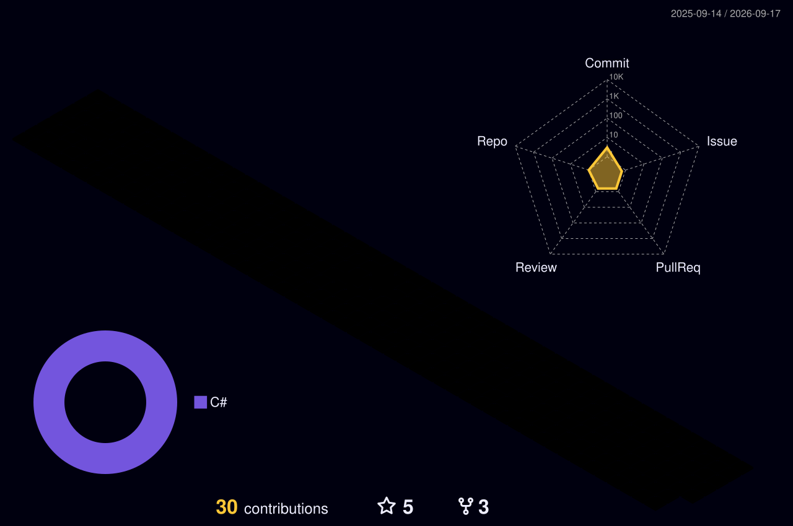

### Hi! I'm Grazi Falk 👋

 

  
     
<h2>GitHub Stats</h2>

<a href="https://github.com/grazifalk/">

<a href="https://github.com/grazifalk/">

##
    
<h2>GitHub Trophies</h2>

##

<picture>
  <source
    media="(prefers-color-scheme: dark)"
    srcset="https://raw.githubusercontent.com/grazifalk/grazifalk/output/github-contribution-grid-snake-dark.svg"
  />
  <source
    media="(prefers-color-scheme: light)"
    srcset="https://raw.githubusercontent.com/grazifalk/grazifalk/output/github-contribution-grid-snake.svg"
  />
  
</picture>
  
##
  

  

  

<!--
**grazifalk/grazifalk** is a ✨ _special_ ✨ repository because its `README.md` (this file) appears on your GitHub profile.

Here are some ideas to get you started:

- 🔭 I’m currently working on ...
- 🌱 I’m currently learning ...
- 👯 I’m looking to collaborate on ...
- 🤔 I’m looking for help with ...
- 💬 Ask me about ...
- 📫 How to reach me: ...
- 😄 Pronouns: ...
- ⚡ Fun fact: ...
-->
